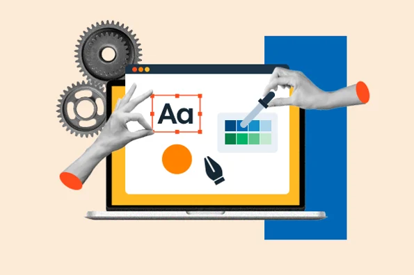

# Scott Lineberger
[My resume removed](https://#)

## UX Process

- Sketches (Coming Soon)
- Mockups (Coming Soon)
- Wireframing & Prototyping (Coming Soon)
  
  
## Websites

- [News Website,version1.0](https://matsunagateitoku.github.io/news/)
- [News Website,version2.0](https://matsunagateitoku.github.io/STDP_News/)
- [Haiku Website](https://matsunagateitoku.github.io/Haiku-Website/)
- [Analyst Workbench](https://matsunagateitoku.github.io/Portfolio/websites/awb/awb.html)
- [Analyst Workbench2.0](https://matsunagateitoku.github.io/Portfolio/websites/awb/awb2.html)
- [Analyst Workbench3.0](https://matsunagateitoku.github.io/Portfolio/websites/awb/awb4.html)
- [Family Album](https://matsunagateitoku.github.io/family/)
- [Wordcloud](https://matsunagateitoku.github.io/news/wordcloud.html?)
- [NLP Toolkit](https://dolphin-app-kjvwi.ondigitalocean.app/)
- [Federated Search Tool (Coming Soon)](https://matsunagateitoku.github.io/Portfolio/websites/fed_search.html)
- Convert a url to a wordcloud (Coming Soon)
  
  Class website projects:
- Dice game (Coming Soon)
- qr code (Coming Soon)

## Python & Data science 

  
| Notebook          |         Discription                                | Colab link    |
|-------------------|----------------------------------------------|------|
| **Great Schools**   | Leveraging the Great School's API to compare local schools      |                                     |
| **NBA Over/Unders Bets Project**     | Using the NBA's API to track team win totals  |                     |

## NLP projects

| Notebook          | Colab link                                  |
|-------------------|----------------------------------------------|
| **[Basic NLP techniques](https://github.com/matsunagateitoku/Portfolio/blob/main/notebooks/VISTA%20Vision.ipynb)**     |                       |
| **[NLP Text Processing Pipeline](https://nbviewer.org/github/matsunagateitoku/Portfolio/blob/main/Text%20preprocessing%20pipeline%20%281%29.ipynb)**     |                       |
| **[Examples of NLP on Chinese Text](https://github.com/matsunagateitoku/Portfolio/blob/main/notebooks/Chinese%20Vista%20Vision%20for%20export.ipynb)**     |                         |
| **NER Flask tool**     | TBD 
| **POS Flask tool**     | TBD 
| **Federated Dictionary Tool**     | TBD                 |
| **Website to Wordcloud**     | TBD                 |
| **Dividing datasets into test, training, walidate**     | TBD                     |
| **Fasttext Document Simalarity from eCornell**     | TBD   |
| **[eCornell notes](https://github.com/matsunagateitoku/Portfolio/blob/main/notebooks/eCornell_new.ipynb)**  |    
| **SANS notes**     | TBD    |     notebooks/Notes from SANS course .ipynb

    
## Machine Learning projects
| Notebook          | Colab link                                  |
|-------------------|----------------------------------------------|
| **TBD**                              |                       |
| **TBD**     |                       |

## Deep Learning  projects
| Notebook          | Colab link                                  |
|-------------------|----------------------------------------------|
**TBD** 

