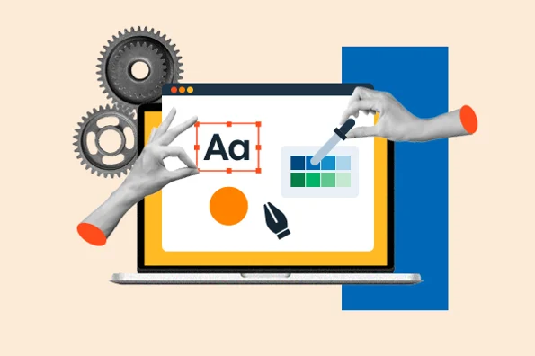

# Scott Lineberger 
[My resume (removed for now)](https://#)

## UX Process

- Sketches (Coming soon)
- Mockups (Coming soon)
- Wireframing & Prototyping (Coming soon)
- Research (Coming soon)
- [Lo-Fi Mockups](https://matsunagateitoku.github.io/Portfolio/websites/lexi_wire.html)
- [Mockups](https://matsunagateitoku.github.io/Portfolio/websites/lexi_mockups.html)
- [Wireframing](https://matsunagateitoku.github.io/Portfolio/websites/lexi-wireframes.html)
- [Research](https://matsunagateitoku.github.io/Portfolio/websites/UX_plan.txt)
- [LEXI plan](./websites/lexi.pdf)
- [LEXI demo](https://matsunagateitoku.github.io/Portfolio/websites/lexi4.html)
   
## Websites

- [News Website,version1.0](https://matsunagateitoku.github.io/news/)
- [News Website,version2.0](https://matsunagateitoku.github.io/STDP_News/)
- [News Website,version3.0](https://matsunagateitoku.github.io/AI_News/)
- [Haiku Website](https://matsunagateitoku.github.io/Haiku-Website/)
- [Analyst Workbench](https://matsunagateitoku.github.io/Portfolio/websites/awb/awb.html)
- [Analyst Workbench2.0](https://matsunagateitoku.github.io/Portfolio/websites/awb/awb2.html)
- [Analyst Workbench3.0](https://matsunagateitoku.github.io/Portfolio/websites/awb/awb4.html)
- [Family Album](https://matsunagateitoku.github.io/family/)
- [Wordcloud](https://matsunagateitoku.github.io/news/wordcloud.html?)
- [NLP Toolkit](https://dolphin-app-kjvwi.ondigitalocean.app/)
- [Federated Search Tool (Coming Soon)](https://matsunagateitoku.github.io/Portfolio/websites/fed_search.html)

- [Portfolio](https://matsunagateitoku.github.io/Portfolio/websites/haiku.html)

## Class website projects:
- [Dice roll](https://matsunagateitoku.github.io/Portfolio/websites/dice-roller.html)
- [Generate a QR code for Website URL](https://matsunagateitoku.github.io/Portfolio/websites/url.html)

## Python & Data science 

  
| Notebook          |         Discription                                | Colab link    |
|-------------------|----------------------------------------------|------|
| **Great Schools**   | Leveraging the Great School's API to compare local schools      |                                     |
| **NBA Over/Unders Bets Project**     | Using the NBA's API to track team win totals  |                     |

## NLP projects

| Notebook          | Colab link                                  |
|-------------------|----------------------------------------------|
| **[Basic NLP techniques](https://github.com/matsunagateitoku/Portfolio/blob/main/notebooks/VISTA%20Vision.ipynb)**     |                       |
| **[NLP Text Processing Pipeline](https://nbviewer.org/github/matsunagateitoku/Portfolio/blob/main/Text%20preprocessing%20pipeline%20%281%29.ipynb)**     |                       |
| **[Examples of NLP on Chinese Text](https://github.com/matsunagateitoku/Portfolio/blob/main/notebooks/Chinese%20Vista%20Vision%20for%20export.ipynb)**     |                         |
| **NER Flask tool**     | TBD 
| **POS Flask tool**     | TBD 
| **Federated Dictionary Tool**     | TBD                 |
| **Website to Wordcloud**     | TBD                 |
| **Dividing datasets into test, training, walidate**     | TBD                     |
| **Fasttext Document Simalarity from eCornell**     | TBD   |
| **[eCornell notes](https://github.com/matsunagateitoku/Portfolio/blob/main/notebooks/eCornell_new.ipynb)**  |    
| **SANS notes**     | TBD    |     notebooks/Notes from SANS course .ipynb

    
## Machine Learning projects
| Notebook          | Colab link                                  |
|-------------------|---------------------------------------------|
| **TBD**                              |                       |
| **TBD**     |                       |

## Deep Learning  projects
| Notebook          | Colab link                                  |
|-------------------|----------------------------------------------|
**TBD** 

)))))))))))))))))))))))))))))))))

# Scott Lineberger — Portfolio

<!-- Resume link placeholder -->
<!-- [📄 Resume](https://#) -->

---

## 🔤 LEXI — AI Translation Glossary Tool

A federated lookup tool for translators featuring contextual translation recommendations and multi-source querying.

| Resource | Link |
|----------|------|
| Project Plan | [LEXI Plan (PDF)](./websites/lexi.pdf) |
| Live Demo | [LEXI Demo](https://matsunagateitoku.github.io/Portfolio/websites/lexi4.html) |

---

## 🎨 UX Process

| Stage | Status |
|-------|--------|
| Sketches | Coming soon |
| Lo-Fi Mockups | [View →](https://matsunagateitoku.github.io/Portfolio/websites/lexi_wire.html) |
| Mockups | [View →](https://matsunagateitoku.github.io/Portfolio/websites/lexi_mockups.html) |
| Wireframing & Prototyping | [View →](https://matsunagateitoku.github.io/Portfolio/websites/lexi-wireframes.html) |
| Research | [View →](https://matsunagateitoku.github.io/Portfolio/websites/UX_plan.txt) |

---

## 🌐 Websites

| Project | Description |
|---------|-------------|
| [News Website v1.0](https://matsunagateitoku.github.io/news/) | First iteration of a news aggregation site |
| [News Website v2.0](https://matsunagateitoku.github.io/STDP_News/) | Redesigned news site |
| [Haiku Website](https://matsunagateitoku.github.io/Haiku-Website/) | Creative writing showcase |
| [Analyst Workbench v1.0](https://matsunagateitoku.github.io/Portfolio/websites/awb/awb.html) | Analyst-facing data tool |
| [Analyst Workbench v2.0](https://matsunagateitoku.github.io/Portfolio/websites/awb/awb2.html) | Improved iteration |
| [Analyst Workbench v3.0](https://matsunagateitoku.github.io/Portfolio/websites/awb/awb4.html) | Latest version |
| [Family Album](https://matsunagateitoku.github.io/family/) | Photo album site |
| [Wordcloud](https://matsunagateitoku.github.io/news/wordcloud.html?) | News-driven word cloud visualization |
| [NLP Toolkit](https://dolphin-app-kjvwi.ondigitalocean.app/) | Deployed NLP Flask application |
| Federated Search Tool | Coming soon |
| URL to Wordcloud | Coming soon |

**Class Projects** — Dice Game · QR Code *(Coming soon)*

---

## 🐍 Python & Data Science

| Project | Description | Notebook |
|---------|-------------|----------|
| **Great Schools** | Leveraging the Great Schools API to compare local schools |  |
| **NBA Over/Unders** | Using the NBA API to track team win totals |  |

---

## 🗣️ NLP Projects

| Project | Notebook |
|---------|----------|
| [Basic NLP Techniques](https://github.com/matsunagateitoku/Portfolio/blob/main/notebooks/VISTA%20Vision.ipynb) |  |
| [NLP Text Processing Pipeline](https://nbviewer.org/github/matsunagateitoku/Portfolio/blob/main/Text%20preprocessing%20pipeline%20%281%29.ipynb) |  |
| [NLP on Chinese Text](https://github.com/matsunagateitoku/Portfolio/blob/main/notebooks/Chinese%20Vista%20Vision%20for%20export.ipynb) |  |
| [eCornell Notes](https://github.com/matsunagateitoku/Portfolio/blob/main/notebooks/eCornell_new.ipynb) |  |
| NER Flask Tool | Coming soon |
| POS Flask Tool | Coming soon |
| Federated Dictionary Tool | Coming soon |
| Website to Wordcloud | Coming soon |
| Train/Test/Validate Dataset Splitting | Coming soon |
| FastText Document Similarity (eCornell) | Coming soon |
| SANS Course Notes | Coming soon |

---

## 🤖 Machine Learning Projects

| Project | Notebook |
|---------|----------|
| TBD |  |
| TBD |  |

---

## 🧠 Deep Learning Projects

*Coming soon*

# Scott Lineberger

**AI Integration Lead · NLP · Translation Technology · Analyst Workflow Tooling**

---

## About

I build analyst-facing tools at the intersection of **translation technology**, **NLP**, and **AI integration**. My work focuses on bridging machine learning capabilities with real analyst workflows — from federated glossary search to multi-model evaluation pipelines.

Previously a visiting professor in East Asian Studies. Fluent in the gap between what language models do and what translators actually need.

---

## 🛠️ Tech Stack

**NLP / ML:** spaCy · NLTK · FastText · BM25 · SPLADE · BGE-M3 · Hugging Face  
**Data:** Pandas · NumPy · Scikit-learn  
**Cloud:** AWS Bedrock · SageMaker · Comprehend · Lambda  
**Languages:** English · Chinese (Mandarin) · Japanese

---

## ⬡ Featured Project — LEXI

> AI-powered translation glossary with federated multi-source search and contextual recommendations.

| Resource | Link |
|---|---|
| 📄 Project Plan | [LEXI Plan (PDF)](https://matsunagateitoku.github.io/Portfolio/websites/lexi.pdf) |
| 🚀 Live Demo | [lexi4.html](https://matsunagateitoku.github.io/Portfolio/websites/lexi4.html) |
| 🔬 Lo-Fi Mockups | [View](https://matsunagateitoku.github.io/Portfolio/websites/lexi_wire.html) |
| 🎨 Mockups | [View](https://matsunagateitoku.github.io/Portfolio/websites/lexi_mockups.html) |
| 📐 Wireframes | [View](https://matsunagateitoku.github.io/Portfolio/websites/lexi-wireframes.html) |
| 📋 UX Research | [View](https://matsunagateitoku.github.io/Portfolio/websites/UX_plan.txt) |

---

## 🗣️ NLP Projects

| Project | Status | Notebook |
|---|---|---|
| Basic NLP Techniques | ✅ Live |  |
| NLP Text Processing Pipeline | ✅ Live |  |
| NLP on Chinese Text | ✅ Live |  |
| eCornell Notes | ✅ Live |  |
| NER Flask Tool | 🔧 Coming soon | — |
| POS Flask Tool | 🔧 Coming soon | — |
| Federated Dictionary Tool | 🔧 Coming soon | — |
| FastText Document Similarity (eCornell) | 🔧 Coming soon | — |
| Train / Test / Validate Dataset Splitting | 🔧 Coming soon | — |
| SANS Course Notes | 🔧 Coming soon | — |

---

## 🐍 Python & Data Science

| Project | Description | Notebook |
|---|---|---|
| Great Schools API | Comparing local schools using the Great Schools API |  |
| NBA Over/Unders | Tracking team win totals via the NBA API |  |

---

## 🌐 Websites & Tools

### Analyst Tools

| Project | Description | Link |
|---|---|---|
| Analyst Workbench v1.0 | Analyst-facing data tool | [→](https://matsunagateitoku.github.io/Portfolio/websites/awb/awb.html) |
| Analyst Workbench v2.0 | Improved iteration | [→](https://matsunagateitoku.github.io/Portfolio/websites/awb/awb2.html) |
| Analyst Workbench v3.0 | Latest version | [→](https://matsunagateitoku.github.io/Portfolio/websites/awb/awb4.html) |
| NLP Toolkit | Deployed NLP Flask application | [→](https://dolphin-app-kjvwi.ondigitalocean.app/) |
| Federated Search Tool | Multi-source search interface | 🔧 Coming soon |

### Content & Creative

| Project | Description | Link |
|---|---|---|
| News Website v1.0 | First iteration of a news aggregation site | [→](https://matsunagateitoku.github.io/news/) |
| News Website v2.0 | Redesigned news site | [→](https://matsunagateitoku.github.io/STDP_News/) |
| News Website v3.0 | AI-driven news | [→](https://matsunagateitoku.github.io/AI_News/) |
| Haiku Website | Classical haiku showcase | [→](https://matsunagateitoku.github.io/Haiku-Website/) |
| Wordcloud | News-driven word cloud visualization | [→](https://matsunagateitoku.github.io/news/wordcloud.html) |
| Family Album | Photo album site | [→](https://matsunagateitoku.github.io/family/) |

---

## 🤖 Machine Learning

| Project | Notebook |
|---|---|
| TBD | 🔧 Coming soon |

---

## 🧠 Deep Learning

| Project | Notebook |
|---|---|
| TBD | 🔧 Coming soon |

---

## 📊 GitHub Stats

---

*AI · NLP · Translation Technology · Language × Code*

